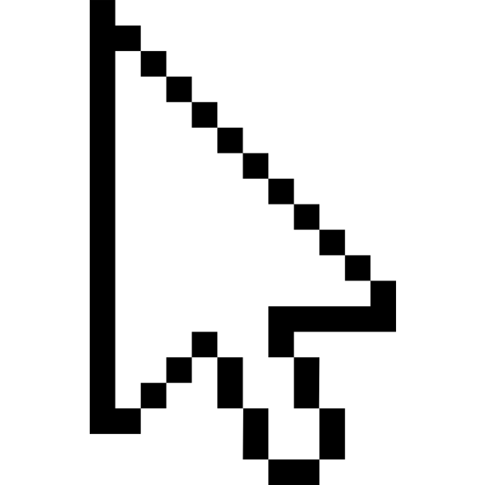

<div align="center">



# ⚡ ValorantAutoClicker

### *Select your agent before anyone else. Every time.*

[](https://github.com)
[](https://github.com)
[](LICENSE)
[](https://github.com)

**🇹🇷 Türkçe** | **🇬🇧 English**

<br>

[](https://github.com/omern2/ValorantAutoClicker/releases/latest)

> 💡 Click the button above to download the latest `.exe` — no installation required, just run and play.

</div>

---

## 🎯 What is ValorantAutoClicker?

**ValorantAutoClicker** is a lightweight, blazing-fast desktop tool designed to give you a competitive edge in **Valorant's agent selection screen**. The moment the selection timer starts, the tool automatically clicks your pre-configured agent — ensuring you lock in your main before anyone else on your team.

Whether you play ranked solo queue or compete in organized matches, **never lose your agent to a teammate again.**

---

## 🇹🇷 Nedir?

**ValorantAutoClicker**, Valorant'ın ajan seçim ekranında sizi rakiplerinizden bir adım önde tutmak için tasarlanmış hafif ve ultra hızlı bir masaüstü aracıdır. Seçim ekranı açıldığı anda, önceden ayarladığınız ajana otomatik olarak tıklar — takım arkadaşlarınızdan önce ana ajanınızı güvenceye alırsınız.

İster solo ranked, ister organize maçlar oynayın, **bir daha asla ajanınızı kaybetmeyin.**

---

## ✨ Features / Özellikler

| 🇬🇧 English | 🇹🇷 Türkçe |
|---|---|
| ⚡ Ultra-fast automated agent locking | ⚡ Ultra hızlı otomatik ajan kilitleme |
| 🖱️ Pixel-perfect click detection | 🖱️ Piksel hassasiyetinde tıklama |
| 🔧 Simple one-time setup | 🔧 Basit, tek seferlik kurulum |
| 💾 Save multiple agent profiles | 💾 Birden fazla ajan profili kaydetme |
| 🪟 Lightweight — runs in background | 🪟 Hafif yapı — arka planda çalışır |
| 🔇 No FPS impact, zero game lag | 🔇 FPS etkisi yok, sıfır gecikme |
| 🛡️ No game file modification | 🛡️ Oyun dosyalarına dokunmaz |
| 🔔 Visual + audio lock confirmation | 🔔 Görsel ve sesli kilitleme bildirimi |

---

## 🚀 Getting Started / Kurulum

### 🇬🇧 English

1. Run `ValorantAutoClicker.exe`
2. Click **"Set Position"** next to your 1st or 2nd choice agent slot
3. Move your cursor to your agent on screen — it auto-saves after **3 seconds**
4. Adjust **Click Speed** (default: 10ms) and **Repeat Duration** if needed
5. Press **▶ Start (F6)** or hit `F6` — done!

> 💡 You can set **2 agent preferences** — if your first pick is taken, it goes for the second.

### 🇹🇷 Türkçe

1. `ValorantAutoClicker.exe`'yi çalıştırın
2. **1. veya 2. Tercih** yanındaki **"Pozisyonu Ayarla"** butonuna tıklayın
3. İmleci istediğiniz ajanın üzerine götürün — **3 saniye** sonra otomatik kaydedilir
4. **Tıklama Hızı** (varsayılan: 10ms) ve **Tekrarlama Süresi**'ni ayarlayın
5. **▶ Başlat (F6)** butonuna veya `F6` tuşuna basın — hazır!

> 💡 **2 ajan tercihi** ayarlayabilirsiniz — ilk tercihiniz alınmışsa ikincisine geçer.

---

## 🛠️ Requirements / Gereksinimler

- Windows 10 / 11 (64-bit)
- .NET Framework 4.8+ or Python 3.10+
- Valorant (latest version)
- Administrator privileges for click automation

---

## ⚙️ Configuration / Yapılandırma

```json
{
  "agent_position": { "x": 854, "y": 512 },
  "trigger_hotkey": "F2",
  "save_hotkey": "F1",
  "click_delay_ms": 50,
  "auto_confirm": true,
  "sound_feedback": true
}
```

> ⚠️ **Tip:** Lower `click_delay_ms` = faster lock. Default `50ms` works perfectly for most systems.

---

## 📸 Preview / Önizleme

```
[ Valorant Agent Select Screen Detected ]
  → Target Agent: Jett
  → Click registered in: 52ms
  ✅ Agent locked successfully!
```

---

## 🧠 How It Works / Nasıl Çalışır?

### 🇬🇧
The tool uses **screen region monitoring** to detect when the agent selection screen appears. Once detected, it dispatches a simulated mouse click to the saved pixel coordinates of your agent, then confirms the lock — all within milliseconds.

### 🇹🇷
Araç, ajan seçim ekranının açıldığını tespit etmek için **ekran bölgesi izleme** yöntemini kullanır. Tespit edildiğinde, kaydedilen piksel koordinatlarına simüle edilmiş bir fare tıklaması gönderir ve kilitlemeyi onaylar — tüm bunlar milisaniyeler içinde gerçekleşir.

---

## ❓ FAQ / Sıkça Sorulan Sorular

**🇬🇧 Is this detectable by Vanguard?**  
The tool simulates standard mouse input and does not interact with game memory or files. It operates entirely at the OS level. Use at your own discretion.

**🇹🇷 Vanguard tarafından tespit edilir mi?**  
Araç, standart fare girişini simüle eder; oyun belleği veya dosyalarına müdahale etmez. Tamamen işletim sistemi seviyesinde çalışır. Kendi sorumluluğunuzda kullanın.

---

**🇬🇧 Does it work on all screen resolutions?**  
Yes. The setup process requires you to manually position your cursor over the agent once — after that, it adapts to your screen.

**🇹🇷 Tüm ekran çözünürlüklerinde çalışır mı?**  
Evet. Kurulum sırasında imlecinizi bir kez ajanın üzerine konumlandırmanız yeterlidir — sonrasında ekranınıza otomatik uyum sağlar.

---

## ⚠️ Disclaimer / Sorumluluk Reddi

> 🇬🇧 This tool is intended for **personal, non-commercial use** only. The developer is not responsible for any account penalties or bans resulting from misuse. Use responsibly.

> 🇹🇷 Bu araç yalnızca **kişisel, ticari olmayan kullanım** amacıyla tasarlanmıştır. Geliştirici, yanlış kullanımdan kaynaklanan hesap cezaları veya yasaklardan sorumlu tutulamaz. Sorumluluk size aittir.

---

## 👤 Developer / Geliştirici

**valorta**  
Valorant oyuncusu & bağımsız geliştirici  
*"Built this because I was tired of losing Jett to my teammates."*

---

## ⭐ Support / Destek

If this tool helped you, **drop a ⭐ star** on the repo — it means everything and helps others find it!

Bu araç işinize yaradıysa, repoya **⭐ yıldız** bırakın — bu çok şey ifade eder ve başkalarının bulmasına yardımcı olur!

---

<div align="center">

**Made with ❤️ for the Valorant community**  
*Lock in. Win out.*

</div>
